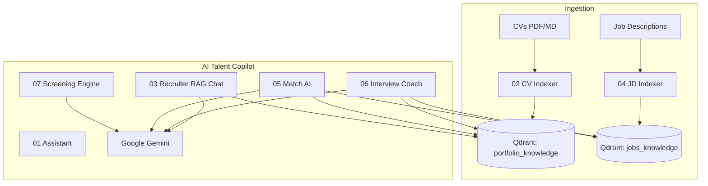

# AI Talent Copilot

**Intelligent recruiting assistant** powered by n8n, Google Gemini, and RAG (Qdrant).

Portfolio product by [Christian del Pozo](https://github.com/delpozochristian) — demonstrating AI Engineering, automation, RAG systems, and product thinking for digital transformation in Talent Acquisition.

[](https://n8n.io)
[](https://ai.google.dev)
[](https://qdrant.tech)

---

## Business problem

Recruiters waste hours screening CVs manually:

| Before | After (AI Talent Copilot) |
|---|---|
| Read 100 CVs one by one | Batch screening with ranked shortlist |
| Subjective “gut feel” notes | Evidence-based scores + justifications |
| Inconsistent interview prep | Standardized questions mapped to gaps |
| Hard to explain why a candidate advanced | Auditable strengths / gaps / recommendation |

---

## Solution

**AI Talent Copilot** is a suite of n8n workflows that help recruiters:

1. Index CVs and job descriptions into a vector knowledge base (RAG)
2. Chat with candidate / role context
3. Compare one candidate vs a JD (match analysis)
4. **Screen multiple candidates and return a ranked JSON shortlist**
5. Generate interview plans and practice answers

---

## Architecture



**Stack:** n8n · LangChain nodes · Google Gemini (LLM + embeddings) · Qdrant

---

## Product modules (workflows)

| # | Module | What it does |
|---|---|---|
| 01 | AI Recruiter Assistant | Baseline conversational assistant |
| 02 | CV RAG Indexer | Embeds CV → `portfolio_knowledge` |
| 03 | Recruiter AI | Chat over candidate RAG |
| 04 | Job Description Indexer | Embeds JD → `jobs_knowledge` |
| 05 | Recruiter Match AI | Single candidate vs JD (scores, gaps, questions) |
| 06 | Interview Coach AI | Interview prep + storytelling |
| **07** | **Recruiter Screening Engine** | **Multi-CV batch scoring + ranking JSON** |

Demo data (fictional): [`demo/`](./demo/) — Senior Backend Java Engineer + 3 candidates.

Prompt standards (anti-bias, auditable): [`docs/PROMPTS.md`](./docs/PROMPTS.md)

---

## End-to-end flow

```
1. Index JD          → workflow 04  (or paste JD into 07)
2. Index CV(s)       → workflow 02  (single) / batch texts in 07
3. Screen shortlist  → workflow 07  → ranked JSON
4. Deep-dive match   → workflow 05
5. Interview plan    → workflow 06
```

---

## Example screening result

```json
{
  "candidate_name": "Alex Rivera",
  "overall_score": 92,
  "technical_match": 95,
  "experience_match": 90,
  "leadership_match": 88,
  "strengths": [
    "Java 17 + Spring Boot microservices on AWS EKS",
    "Kafka at ~40M messages/day",
    "Mentored engineers and ran hiring loops"
  ],
  "gaps": ["Terraform depth not evidenced"],
  "recommendation": "Top priority interview — strong hard-skill and leadership match.",
  "interview_priority": "HIGH"
}
```

Full sample ranking: [`demo/sample_screening_result.json`](./demo/sample_screening_result.json)

---

## Business impact

| Metric | Manual process | With AI Talent Copilot |
|---|---|---|
| Time to shortlist 50 CVs | Days | Minutes (batch + ranking) |
| Consistency | Varies by recruiter | Shared rubric + JSON scores |
| Explainability | Informal notes | Strengths / gaps / recommendation |
| Interview quality | Ad-hoc questions | Gap-driven question sets |
| Scalability | Linear with headcount | Parallelizable automation |

**Before:** Recruiter analyzes 100 CVs manually.  
**After:** AI prioritizes candidates and generates actionable insights automatically.

---

## Use cases

- TA teams screening high-volume tech requisitions
- Hiring managers who want a ranked shortlist before interviews
- Agencies comparing multiple profiles against one JD
- Demo / PoC for AI-assisted Talent Acquisition platforms

---

## Quick start

1. Run Qdrant + n8n (see [`docs/SETUP.md`](./docs/SETUP.md))
2. Import any `*/workflow.json`
3. Attach Gemini (+ Qdrant for RAG modules)
4. For a product demo: import **07**, Execute workflow → inspect ranked JSON
5. Optional LinkedIn narrative: [`docs/LINKEDIN_DEMO.md`](./docs/LINKEDIN_DEMO.md)

---

## Suggested screenshots (for README / LinkedIn)

1. n8n canvas of **07 Screening Engine** (batch → score → rank)
2. Execution output JSON with ranked candidates
3. Qdrant collections `portfolio_knowledge` / `jobs_knowledge`
4. Chat UI of **05 Match AI** with compatibility breakdown
5. **06 Interview Coach** question list

---

## Security & ethics

- No API keys in the repo
- Demo candidates are **fictional**
- Prompts forbid demographic / protected-attribute bias
- Personal PDFs stay local (`.gitignore`)

---

## License

Reference portfolio — free to adapt with attribution.
