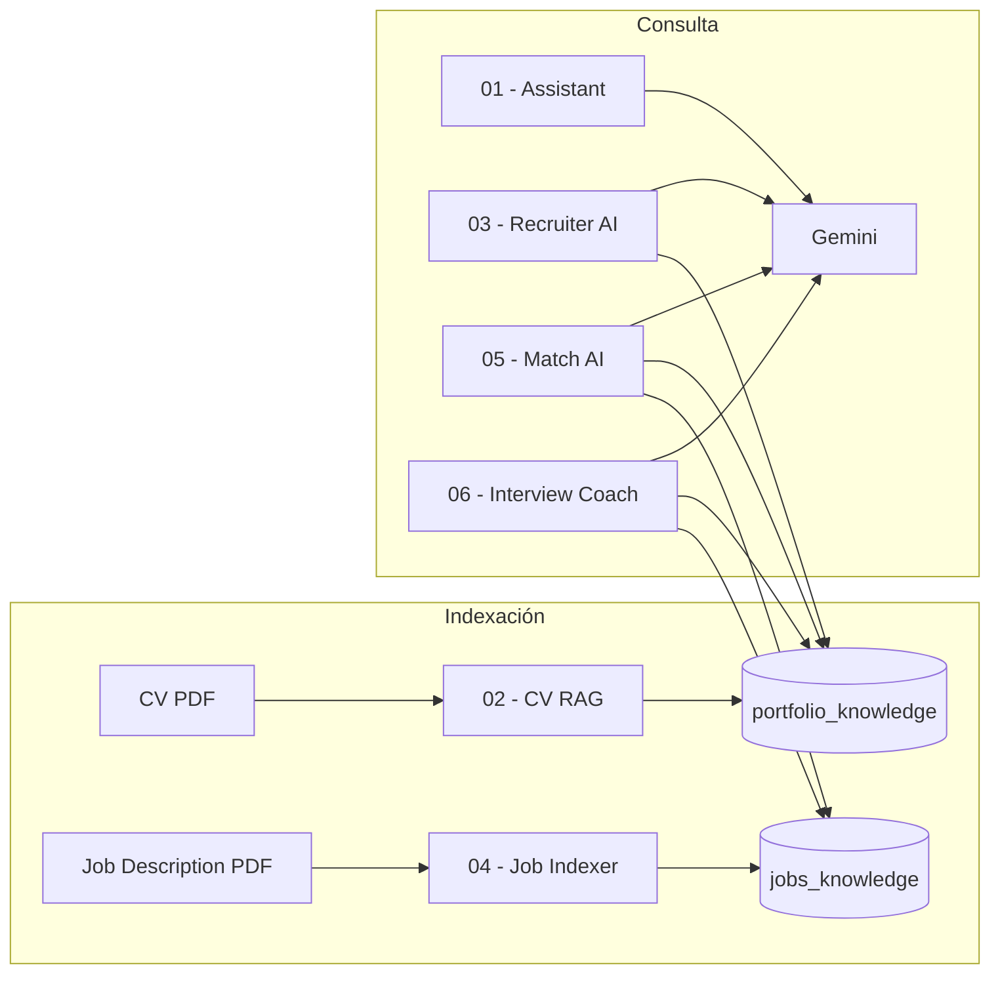

# AI Automation Portfolio

Portfolio de workflows de [n8n](https://n8n.io) para **reclutamiento y preparación de entrevistas con IA**: chat, indexación RAG, matching candidato–puesto y coaching de entrevista.

**Autor:** [Christian del Pozo](https://github.com/delpozochristian)

---

## Stack

| Tecnología | Uso |
|---|---|
| **n8n** | Orquestación de workflows |
| **Google Gemini** | LLM y embeddings |
| **Qdrant** | Base de datos vectorial |
| **LangChain (n8n)** | Agentes IA y herramientas RAG |

---

## Arquitectura

**Dependencia:** los workflows 03, 05 y 06 asumen que las colecciones de Qdrant ya están pobladas (workflows 02 y 04).

---

## Proyectos

| # | Carpeta | Descripción | Trigger | RAG |
|---|---|---|---|---|
| 01 | [`01-ai-recruiter-assistant`](./01-ai-recruiter-assistant/) | Chat con contexto fijo del perfil (sin vector store) | Chat | No |
| 02 | [`02-cv-rag-indexar-documentos`](./02-cv-rag-indexar-documentos/) | Indexa el CV en Qdrant (`portfolio_knowledge`) | Manual | Write |
| 03 | [`03-recruiter-ai`](./03-recruiter-ai/) | Chat con RAG sobre el CV indexado | Chat | Read CV |
| 04 | [`04-job-description-indexer`](./04-job-description-indexer/) | Indexa la descripción del puesto (`jobs_knowledge`) | Manual | Write |
| 05 | [`05-recruiter-match-ai`](./05-recruiter-match-ai/) | Scoring candidato vs. puesto (compatibilidad, gaps, riesgos) | Chat | Read ambas |
| 06 | [`06-interview-coach-ai`](./06-interview-coach-ai/) | Coach de entrevista: preguntas, respuestas y storytelling | Chat | Read ambas |

### 05 vs 06

| | **05 Match AI** | **06 Interview Coach** |
|---|---|---|
| Objetivo | Evaluar fit candidato–puesto | Preparar al candidato para la entrevista |
| Salida típica | % compatibilidad, fortalezas, skills faltantes | Preguntas probables, respuestas en 1ª persona, historias |
| Cuándo usarlo | Screening / decisión | Antes de una entrevista real |

### Flujo recomendado

1. Ejecutar **02** → indexar CV.
2. Ejecutar **04** → indexar job description.
3. **03** → consultas sobre el candidato.
4. **05** → análisis de compatibilidad.
5. **06** → preparación de entrevista (preguntas, respuestas, riesgos).
6. **01** → independiente (sin RAG; útil para demos rápidas).

---

## Inicio rápido

### Requisitos

- n8n v1.x con nodos LangChain
- API key de [Google AI Studio](https://aistudio.google.com/) (Gemini)
- Qdrant (local o cloud)

### Importar un workflow

1. En n8n: **Workflows → Import from File**
2. Elegir el `workflow.json` de la carpeta del proyecto
3. Reasignar credenciales (ver [docs/SETUP.md](./docs/SETUP.md))
4. Activar el workflow (chat) o ejecutarlo (indexación)

Guía completa: **[docs/SETUP.md](./docs/SETUP.md)**

---

## Colecciones Qdrant

| Colección | Origen | Escrita por | Leída por |
|---|---|---|---|
| `portfolio_knowledge` | CV del candidato | 02 | 03, 05, 06 |
| `jobs_knowledge` | Descripción del puesto | 04 | 05, 06 |

---

## Seguridad

- Sin API keys ni secretos en el repo; solo referencias a credenciales de n8n.
- Los PDFs (CV, job descriptions) no se versionan (ver `.gitignore`).
- Tras importar, reasigná las credenciales en cada nodo.

---

## Licencia

Uso libre con atribución. Plantillas de referencia; adaptalas a tu entorno.
