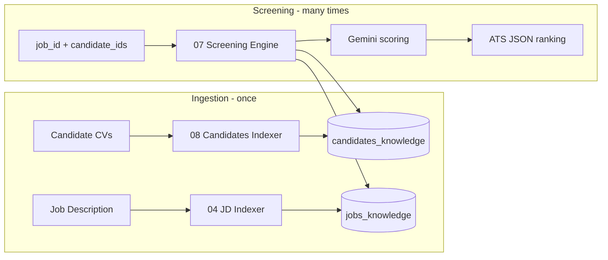
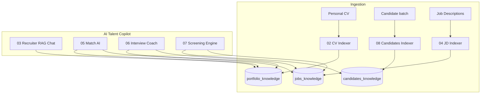

# AI Talent Copilot

**Intelligent recruiting assistant** powered by n8n, Google Gemini, and RAG (Qdrant).

Portfolio product by [Christian del Pozo](https://github.com/delpozochristian) — demonstrating AI Engineering, automation, RAG systems, and product thinking for digital transformation in Talent Acquisition.

[](https://n8n.io)
[](https://ai.google.dev)
[](https://qdrant.tech)

---

## Business problem

Recruiters waste hours screening CVs manually:

| Before | After (AI Talent Copilot) |
|---|---|
| Read 100 CVs one by one | Batch screening with ranked shortlist |
| Subjective “gut feel” notes | Evidence-based scores + justifications |
| Inconsistent interview prep | Standardized questions mapped to gaps |
| Hard to explain why a candidate advanced | Auditable strengths / gaps / recommendation |

---

## Solution

**AI Talent Copilot** is a suite of n8n workflows that help recruiters:

1. Index CVs and job descriptions into vector knowledge bases (RAG)
2. Chat with candidate / role context
3. Compare one candidate vs a JD (match analysis)
4. **Screen multiple candidates and return an ATS-ready ranked JSON shortlist**
5. Generate interview plans and practice answers

---

## Architecture decision: index once, retrieve many

### Why this design

Screening at scale cannot re-parse full PDFs on every run. Parsing + embedding is **expensive** and **slow**. The product separates:

| Phase | When | What happens |
|---|---|---|
| **Ingestion** | Once per CV / JD upload | Extract → embed → store in Qdrant |
| **Screening** | Every requisition / batch | Retrieve top-k chunks → score with Gemini → rank |

### Qdrant collections

| Collection | Purpose | Written by | Read by |
|---|---|---|---|
| `portfolio_knowledge` | Single personal CV (portfolio demos 01–06) | 02 | 03, 05, 06 |
| `jobs_knowledge` | Job descriptions (`job_id` metadata) | 04 | 05, 06, **07** |
| **`candidates_knowledge`** | **Multi-candidate pool (`candidate_id` metadata)** | **08** | **07** |

`portfolio_knowledge` stays for the original personal-portfolio demos.  
**`candidates_knowledge`** is the scalable pool for product screening.

### Screening data flow



**Rule:** Workflow **07 never opens PDFs**. It only retrieves embeddings already stored by **08** and **04**.

---

## Explainable scoring (not just a %)

Each candidate result includes:

- **criteria_scores** — technical / experience / leadership with rationale
- **evidence** — matched requirements, quotes/facts, missing items
- **gaps** and **strengths**
- **recommendation** — `ADVANCE | HOLD | REJECT` + summary
- **interview_priority** — `HIGH | MEDIUM | LOW`

### ATS-oriented JSON contract

Designed for future ATS / webhook integration:

```json
{
  "candidate_id": "cand_001",
  "candidate_name": "Alex Rivera",
  "job_id": "job_001",
  "overall_score": 92,
  "criteria_scores": {
    "technical": { "score": 95, "weight": 0.45, "rationale": "..." },
    "experience": { "score": 90, "weight": 0.35, "rationale": "..." },
    "leadership": { "score": 88, "weight": 0.20, "rationale": "..." }
  },
  "strengths": ["..."],
  "gaps": ["..."],
  "evidence": {
    "matched_requirements": ["..."],
    "quotes_or_facts": ["..."],
    "missing": ["..."]
  },
  "recommendation": {
    "decision": "ADVANCE",
    "summary": "..."
  },
  "interview_priority": "HIGH"
}
```

Full sample ranking: [`demo/sample_screening_result.json`](./demo/sample_screening_result.json)

---

## Architecture overview



**Stack:** n8n · LangChain nodes · Google Gemini (LLM + embeddings) · Qdrant

---

## Product modules (workflows)

| # | Module | What it does |
|---|---|---|
| 01 | AI Recruiter Assistant | Baseline conversational assistant |
| 02 | CV RAG Indexer | Embeds personal CV → `portfolio_knowledge` |
| 03 | Recruiter AI | Chat over candidate RAG |
| 04 | Job Description Indexer | Embeds JD → `jobs_knowledge` |
| 05 | Recruiter Match AI | Single candidate vs JD |
| 06 | Interview Coach AI | Interview prep + storytelling |
| **07** | **Recruiter Screening Engine** | **Multi-candidate RAG scoring + ATS ranking** |
| **08** | **Candidates Knowledge Indexer** | **Batch embed CVs → `candidates_knowledge`** |

Demo data (fictional): [`demo/`](./demo/)  
Prompt standards: [`docs/PROMPTS.md`](./docs/PROMPTS.md)

---

## End-to-end flow

```
1. Index JD                 → 04  → jobs_knowledge
2. Index candidate batch    → 08  → candidates_knowledge
3. Screen shortlist         → 07  → ranked ATS JSON  ★
4. Deep-dive one candidate  → 05
5. Interview plan           → 06
```

---

## Business impact

| Metric | Manual process | With AI Talent Copilot |
|---|---|---|
| Time to shortlist 50 CVs | Days | Minutes (retrieve + rank) |
| Cost per re-screen | Re-parse every PDF | Reuse embeddings |
| Consistency | Varies by recruiter | Shared rubric + JSON |
| Explainability | Informal notes | Criteria + evidence + decision |
| ATS integration | Copy/paste | Stable JSON contract |

**Before:** Recruiter analyzes 100 CVs manually.  
**After:** AI prioritizes candidates and generates actionable, auditable insights.

---

## Use cases

- TA teams screening high-volume tech requisitions
- Hiring managers who want a ranked shortlist before interviews
- Agencies comparing multiple profiles against one JD
- PoC for AI-assisted Talent Acquisition / ATS enrichment

---

## Quick start

1. Run Qdrant + n8n ([`docs/SETUP.md`](./docs/SETUP.md))
2. Import **08** → Execute (index demo candidates)
3. Import **04** → index the sample JD (or rely on job summary fallback notes in SETUP)
4. Import **07** → Execute → inspect ranked ATS JSON
5. LinkedIn narrative: [`docs/LINKEDIN_DEMO.md`](./docs/LINKEDIN_DEMO.md)

---

## Suggested screenshots

1. Qdrant showing `candidates_knowledge` + `jobs_knowledge`
2. n8n canvas of **08** (index) and **07** (screen)
3. Ranked ATS JSON output with `criteria_scores` + `evidence`
4. **05** match chat / **06** interview coach

---

## Security & ethics

- No API keys in the repo
- Demo candidates are **fictional**
- Prompts forbid demographic / protected-attribute bias
- Personal PDFs stay local (`.gitignore`)

---

## License

Reference portfolio — free to adapt with attribution.
