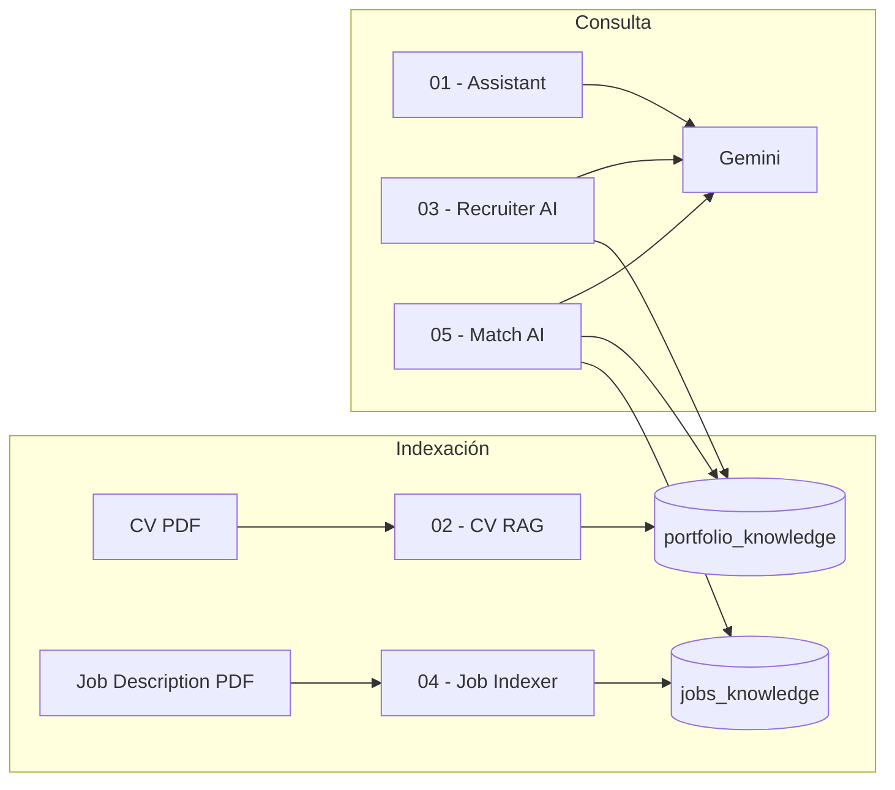

# AI Automation Portfolio

Portfolio de workflows de [n8n](https://n8n.io) orientados a **reclutamiento con IA**: asistentes conversacionales, indexación RAG y matching candidato–puesto.

**Autor:** [Christian del Pozo](https://github.com/delpozochristian)

---

## Stack

| Tecnología | Uso |
|---|---|
| **n8n** | Orquestación de workflows |
| **Google Gemini** | LLM y embeddings |
| **Qdrant** | Base de datos vectorial |
| **LangChain (n8n)** | Agentes IA y herramientas RAG |

---

## Arquitectura

---

## Proyectos

| # | Carpeta | Descripción | Trigger |
|---|---|---|---|
| 01 | [`01-ai-recruiter-assistant`](./01-ai-recruiter-assistant/) | Chat básico con contexto fijo del perfil profesional | Chat |
| 02 | [`02-cv-rag-indexar-documentos`](./02-cv-rag-indexar-documentos/) | Indexa el CV en Qdrant (`portfolio_knowledge`) | Manual |
| 03 | [`03-recruiter-ai`](./03-recruiter-ai/) | Chat con RAG sobre el CV indexado | Chat |
| 04 | [`04-job-description-indexer`](./04-job-description-indexer/) | Indexa descripciones de puesto en Qdrant (`jobs_knowledge`) | Manual |
| 05 | [`05-recruiter-match-ai`](./05-recruiter-match-ai/) | Compara candidato vs. búsqueda laboral con dos bases RAG | Chat |

### Flujo recomendado

1. Ejecutar **02** para indexar el CV.
2. Ejecutar **04** para indexar la descripción del puesto.
3. Usar **03** para consultas sobre el candidato o **05** para análisis de compatibilidad.
4. **01** funciona de forma independiente (sin RAG).

---

## Inicio rápido

### Requisitos

- n8n v1.x con nodos LangChain habilitados
- API key de [Google AI Studio](https://aistudio.google.com/) (Gemini)
- Qdrant corriendo (local o cloud)

### Importar un workflow

1. En n8n: **Workflows → Import from File**
2. Seleccionar el `workflow.json` de la carpeta del proyecto
3. Configurar credenciales (ver [docs/SETUP.md](./docs/SETUP.md))
4. Activar el workflow

Guía detallada de instalación, credenciales y troubleshooting: **[docs/SETUP.md](./docs/SETUP.md)**

---

## Colecciones Qdrant

| Colección | Origen | Usada por |
|---|---|---|
| `portfolio_knowledge` | CV del candidato | 02, 03, 05 |
| `jobs_knowledge` | Descripción del puesto | 04, 05 |

---

## Seguridad

- Los workflows **no incluyen API keys** ni contraseñas; solo referencias a credenciales de n8n.
- Los PDFs (CV, job descriptions) **no se suben al repo** — deben colocarse localmente en tu instancia de n8n.
- Tras importar, reasigná las credenciales en cada nodo que lo requiera.

---

## Licencia

Uso libre con atribución. Los workflows son plantillas de referencia; adaptalos a tu entorno.
